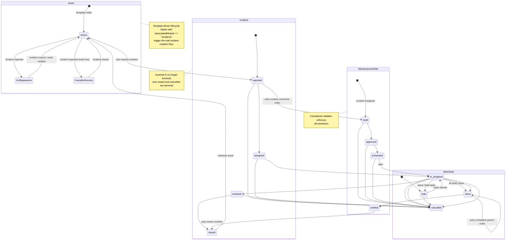

# Asset → Incident Delegation State Machine

Real flow triggered when a user transitions an asset to a state whose `AssociatedModule` is `"incidents"`.



## Trigger condition

A transition from the asset detail page is considered an **incident delegation** when:

```ts
const nextStateConfig = lifecycle.states?.[nextState]
if (nextStateConfig.associatedModule === 'incidents') {
  // Open ReportIncidentSheet with assetId preselected
}
```

## Request contract

```http
POST /api/v1/incidents
Content-Type: application/json

{
  "assetId": "uuid",
  "title": "string",
  "incidentTemplateId": "uuid",
  "typeId": "uuid",
  "priorityId": "uuid?",
  "description": "string?",
  "targetAssetState": "string?"
}
```

- `targetAssetState` is optional. When provided, the backend attempts to transition the asset to that exact state.
- When absent, the backend chooses the first reachable state with `AssociatedModule == "incidents"`.

## Backend behavior

1. Validate the asset exists.
2. Create the incident with state from the incident template (or `"reported"`).
3. Create an `IncidentLifecycleEvent` for the initial state.
4. Call `TryLockAssetForIncidentAsync` to transition the asset to the locked state.
5. Create an `AssetLifecycleEvent` for the asset state change.
6. Return the incident id.
