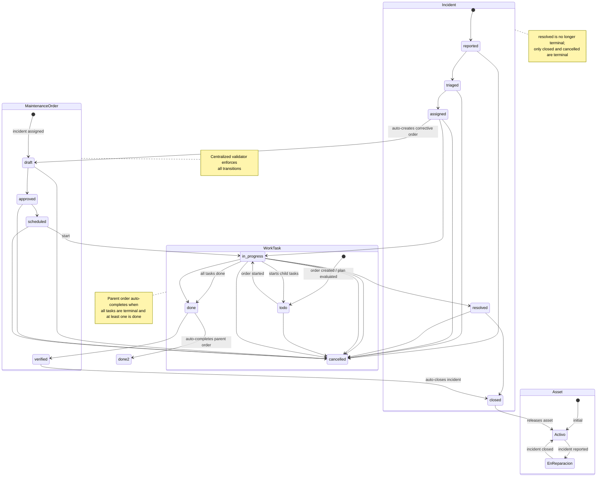
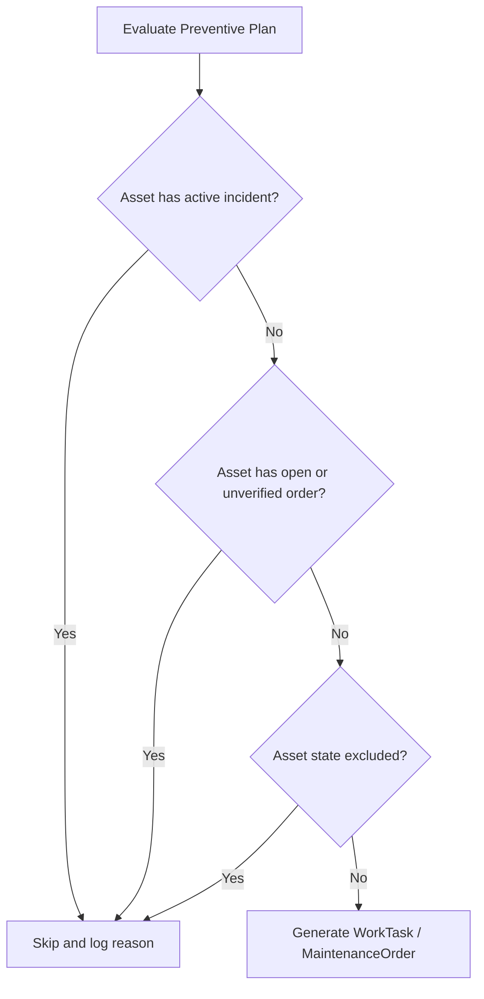
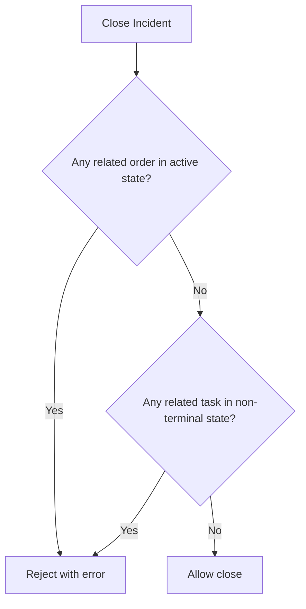

# Maintenance Workflow State Machine Diagram

```mermaid
stateDiagram-v2
    direction TB

    %% Asset lifecycle (template-driven, simplified)
    state "Asset" as asset_state {
        [*] --> Activo : initial
        Activo --> EnReparacion : incident reported
        EnReparacion --> Activo : incident closed
    }

    %% Incident lifecycle
    state "Incident" as incident_state {
        [*] --> reported
        reported --> triaged
        triaged --> assigned
        assigned --> in_progress
        in_progress --> resolved
        resolved --> closed

        reported --> cancelled
        triaged --> cancelled
        assigned --> cancelled
        in_progress --> cancelled
        resolved --> cancelled
    }

    %% Maintenance order lifecycle
    state "MaintenanceOrder" as order_state {
        [*] --> draft : incident assigned
        draft --> approved
        approved --> scheduled
        scheduled --> in_progress : start
        in_progress --> done : all tasks done
        done --> verified

        draft --> cancelled
        approved --> cancelled
        scheduled --> cancelled
        in_progress --> cancelled
    }

    %% Work task lifecycle
    state "WorkTask" as task_state {
        [*] --> todo : order created / plan evaluated
        todo --> in_progress : order started
        in_progress --> done

        todo --> cancelled
        in_progress --> cancelled
    }

    %% Cross-entity coordination
    assigned --> draft : auto-creates corrective order
    in_progress --> todo : starts child tasks
    done --> done2 : auto-completes parent order
    verified --> closed : auto-closes incident
    closed --> Activo : releases asset

    note right of incident_state
        resolved is no longer terminal;
        only closed and cancelled are terminal
    end note

    note right of order_state
        Centralized validator enforces
        all transitions
    end note

    note right of task_state
        Parent order auto-completes when
        all tasks are terminal and at least one is done
    end note
```

## Preventive Plan Execution Guard

```mermaid
flowchart TD
    A[Evaluate Preventive Plan] --> B{Asset has active incident?}
    B -->|Yes| C[Skip and log reason]
    B -->|No| D{Asset has open or unverified order?}
    D -->|Yes| C
    D -->|No| E{Asset state excluded?}
    E -->|Yes| C
    E -->|No| F[Generate WorkTask / MaintenanceOrder]
```

## Incident Closure Guard

```mermaid
flowchart TD
    A[Close Incident] --> B{Any related order in active state?}
    B -->|Yes| C[Reject with error]
    B -->|No| D{Any related task in non-terminal state?}
    D -->|Yes| C
    D -->|No| E[Allow close]
```
